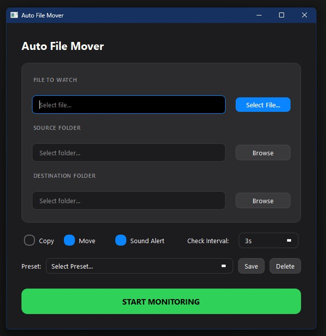

# Auto File Mover
**by Pure Mint Software**

A lightweight Windows desktop application that automatically monitors, copies, or moves files from one location to another with a clean, modern interface.


## App Preview

<p align="center">
  
</p>

## Features

- **Automatic File Monitoring** - Watch for specific files in a source folder and transfer them automatically
- **Copy or Move Modes** - Choose whether to copy files (leave original) or move them (delete after transfer)
- **Smart File Detection** - Only transfers files when they're fully written (no partial transfers)
- **Preset Management** - Save multiple configurations for different file transfer workflows
- **Configurable Check Intervals** - Monitor files every 1 second to 60 minutes based on your needs
- **Custom Sound Alerts** - Play your own notification sound when files are transferred (5-second max)
- **Dark Theme Interface** - Modern, easy-on-the-eyes dark UI with smooth controls
- **System Tray Integration** - Runs quietly in the background, always accessible
- **Real-Time Status Updates** - See exactly what the app is doing at any moment
- **Persistent Settings** - All configurations are saved automatically between sessions

## Installation

### Requirements
- Python 3.8 or higher
- Windows, macOS, or Linux

### Install Dependencies
```bash
pip install PyQt6
```

### Run the Application
```bash
# Run silently (production mode)
pythonw AutoFileMover.pyw

# Run with console (debug mode)
python AutoFileMover.pyw
```

## Usage

### Basic Workflow
1. Click **"Select File..."** to choose the file you want to monitor
2. The source folder is automatically detected from the file path
3. Click **"Browse"** next to Destination Folder to choose where files should go
4. Choose **Copy** (keep original) or **Move** (delete after transfer)
5. Adjust the check interval and enable sound alerts if desired
6. Click **"START MONITORING"** to begin watching for the file

### Presets
Save your frequently used configurations as presets:
- Fill in all fields (file, source, destination)
- Click **"Save"** and give your preset a name
- Select from the dropdown to quickly load saved configurations
- Click **"Delete"** to remove unwanted presets

### System Tray
- **Click "Auto File Mover"** - Open the dashboard
- **Settings** - Configure custom notification sounds
- **Quit** - Exit the application

### Custom Sound Alerts
1. Right-click the system tray icon and select **Settings**
2. Click **"Browse..."** to select your sound file (WAV, MP3, OGG, FLAC)
3. Sound will automatically play for a maximum of 5 seconds
4. Click **"Clear"** to revert to the default system sound

## Data Storage

All configuration data is stored as JSON in the application directory:
- `config.json` - Application settings, presets, and last used configuration

## Building Executable (Optional)

To create a standalone `.exe` file:
```bash
pip install pyinstaller
pyinstaller --onefile --windowed --icon=app.ico AutoFileMover.pyw
```

## Use Cases

- **Download Organization** - Automatically move downloaded files to organized folders
- **Backup Automation** - Copy important files to backup locations when they're updated
- **File Synchronization** - Keep files in sync between different directories
- **Workflow Automation** - Streamline repetitive file management tasks
- **Media Management** - Organize photos, videos, or music files automatically

## License

This project is licensed under the GNU General Public License v3.0 - see the [LICENSE](LICENSE) file for details.

---

**If you find Auto File Mover useful, please give it a star by hitting the button up in the top right corner! ⭐**
